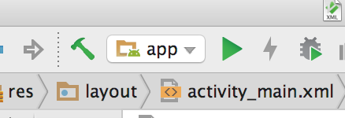
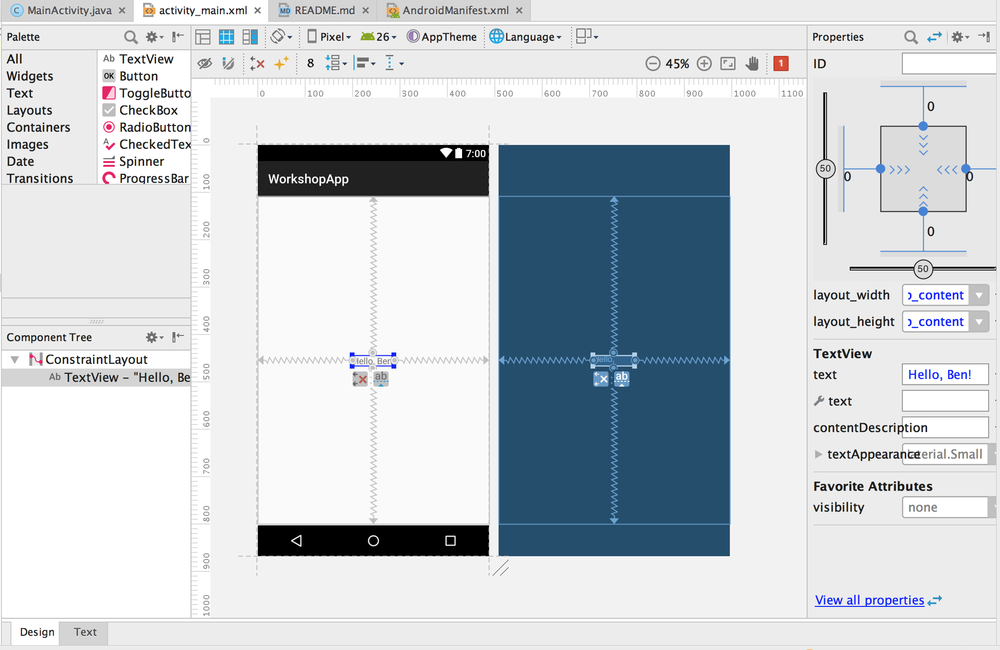
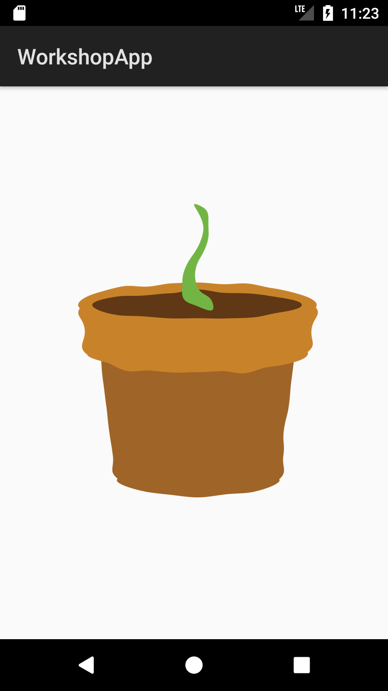

# Hack@Brown 2018 Android Workshop

Hi! Let's make an Android app!

# Step 1: Project Setup

Open [Android Studio](https://developer.android.com/studio/index.html) and
create a new project. The company domain can be whatever you like, but if you
have a website or GitHub account, it's good to use that (like `hackatbrown.org`
or `bnavetta.github.com`).

Note that Android Studio will ask you what the minimum SDK level you want to
target is. This is essentially the oldest version of Android that you're saying
your app will work on. Using a lower SDK level will mean that more devices can
run your app, but it also limits the features you can use. 

# Step 2: Activities!

The core units of any Android app are [Activities](https://developer.android.com/guide/components/activities/index.html).
An activity is a distinct screen in the app that implements the UI for a specific
purpose. For example, an email app might have one activity to send an email and
another that shows your inbox. Android apps can open into specific activities
and transition between each other. We'll only be working with the *main activity*
today, the one that gets launched when the app starts.

# Interlude: Running the App

In the top bar, you should see a green triangle icon. Click this to run your app!
It'll open up a menu where you can pick a connected Android device to run on
or start up an emulator running on your computer. Next to that should be a
greyed-out lightning bolt. This is part of the "Instant Run" feature of Android
Studio, which lets you apply code changes to your app without restarting it!
It'll be enabled once you start the app.



# Step 3: The Layout File

Now, let's make a small change to the app. Open the `activity_main.xml` file.
This is a *layout file*, an XML file that describes a part of your app's UI.
XML is very similar to HTML, and it's being used similarly here. Instead of
creating HTML elements like paragraphs and links, the layout file creates
Android UI components like buttons and maps.


The layout file editor has two
tabs (look on the bottom): *Design* and *Text*. The Text tab shows the raw XML,
and the Design tab has an interactive editor showing a preview of the screen.
You can use either or both as you prefer. We'll stick with the Design tab for now,
since not everyone has used XML before. 

Try changing the text in the label in the middle of the screen and clicking
the Instant Run lightning bolt. In a few moments, you should see your change
appear live!



If you look at the `MainActivity` class, you can see the code that makes this
text appear. Inside the `onCreate` method, there will be this line of code:

```java
setContentView(R.layout.activity_main);
```

The `onCreate` method is called by the Android system whenever an activity is
initialized. It's a great place to set up your UI, which is what's happening here.
The [`R` class](https://developer.android.com/guide/topics/resources/accessing-resources.html) is
generated by the Android build system and provides access to all kinds of resources, like layout
files and images, by their *resource id*. Here, our layout file has ID `activity_main`,
 so we can access it as `R.layout.activity_main`.
 
 # Step 4: Images
 
Speaking of images, let's add some to our app. In this app, users care for a
virtual plant, so we'll need some plant images. Luckily, the Hack@Brown website
uses some lovely flower images that we'll borrow here. Copy them from
[GitHub](./app/src/main/res/drawable) into the `app/src/main/res/drawable` folder
of your project. The `drawable` folder contains image resources like these.

For variety, I'll show the layout XML instead of using the GUI:

```xml
<?xml version="1.0" encoding="utf-8"?>
<android.support.constraint.ConstraintLayout xmlns:android="http://schemas.android.com/apk/res/android"
    xmlns:app="http://schemas.android.com/apk/res-auto"
    xmlns:tools="http://schemas.android.com/tools"
    android:layout_width="match_parent"
    android:layout_height="match_parent"
    tools:context="org.hackatbrown.workshopapp.MainActivity">

    <ImageView
        android:id="@+id/flower_image"
        android:layout_width="0dp"
        android:layout_height="0dp"
        android:src="@drawable/flower_sprout"
        android:contentDescription="Our flower"
        app:layout_constraintBottom_toBottomOf="parent"
        app:layout_constraintLeft_toLeftOf="parent"
        app:layout_constraintRight_toRightOf="parent"
        app:layout_constraintTop_toTopOf="parent"
        app:layout_constraintHorizontal_bias="0.501" />

</android.support.constraint.ConstraintLayout>

```

This looks intimidating, but there are only a few changes from what was there before. First, I
changed the `TextView` to an `ImageView`. I also changed the `android:text` property
to be an `android:src` property with the value `@drawable/flower_sprout`. This `@` syntax
is the Android XML equivalent of `R`, so `@drawable/flower_sprout` is like `R.drawable.flower_sprout`.
The `android:src` property of an `ImageView` indicates which image it shows.

There's also an `android:id` property, set to `@+id/flower_image`. This gives the `ImageView` an
identifier we can use in code as `R.id.flower_image`. The other properties
are for the view's layout system, and essentially say to center the image in its parent.

Update the app with Instant Run again to see your flower!



# Step 5: Referencing Views

Now, we'll add some code to `MainActivity` so it can reference the flower image.
We first add a new property, `private ImageView flower`. This will hold the 
`ImageView` so other code can use it. If Android Studio shows `ImageView` in red,
 put your cursor on it and type `Alt+Enter` to automatically import the `ImageView` class.
 
 Next, in `onCreate`, add this line after the `setContentView` call:
 
 ```java
 this.flower = findViewById(R.id.floweR_image);
 ```
 
 `findViewById` is a method that looks up a view by its ID. Here, we use it to
 look up the flower after loading the layout file.
 
Your `MainActivity.java` file should look something like this now:

```java
// ...

public class MainActivity extends Activity {

    private ImageView flower;

    @Override
    protected void onCreate(Bundle savedInstanceState) {
        super.onCreate(savedInstanceState);
        setContentView(R.layout.activity_main);

        this.flower = findViewById(R.id.flower_image);
    }
}
```

# Step 6: Buttons

We'll next add a button to make our flower grow. Change `activity_main` to be like this (don't
worry, I've marked out the changes below):

```xml
<?xml version="1.0" encoding="utf-8"?>
<android.support.constraint.ConstraintLayout xmlns:android="http://schemas.android.com/apk/res/android"
    xmlns:app="http://schemas.android.com/apk/res-auto"
    xmlns:tools="http://schemas.android.com/tools"
    android:layout_width="match_parent"
    android:layout_height="match_parent"
    tools:context="org.hackatbrown.workshopapp.MainActivity">

    <ImageView
        android:id="@+id/flower_image"
        android:layout_width="wrap_content"
        android:layout_height="wrap_content"
        android:src="@drawable/flower_sprout"
        android:contentDescription="Our flower"
        app:layout_constraintLeft_toLeftOf="parent"
        app:layout_constraintRight_toRightOf="parent"
        app:layout_constraintTop_toTopOf="parent"
        app:layout_constraintBottom_toTopOf="@+id/grow_button"
        app:layout_constraintHorizontal_bias="0.0" />

    <Button
        android:id="@id/grow_button"
        android:layout_width="wrap_content"
        android:layout_height="wrap_content"
        android:text="Grow"
        android:onClick="changeFlower"
        app:layout_constraintLeft_toLeftOf="parent"
        app:layout_constraintRight_toRightOf="parent"
        app:layout_constraintTop_toBottomOf="@id/flower_image"
        app:layout_constraintBottom_toBottomOf="parent"
        android:layout_marginBottom="80dp" />

</android.support.constraint.ConstraintLayout>
```

First of all, I've changed the `app:layout_constraintBottom_toBottomOf="parent"`
attribute of our `ImageView` to `app:layout_constraintBottom_toTopOf="@id+/grow_button"`.
The recommended way of creating layouts in Android is to use a [`ConstraintLayout`](https://developer.android.com/training/constraint-layout/index.html),
which is what we're doing here. This layout lets developers add constraints between
views and their sibling and parent views to figure out the positioning. In XML, these constraints
are represented as `app:layout_constraint<myEdge>_to<otherEdge>`. There are more complicated
kinds of constraints, but we won't go over them here. Keep in mind that you can also add constraints
in the GUI layout editor, but it's trickier to describe how to do that in text. If you're interested,
check out the link to the `ConstraintLayout` documentation above.

Knowing this, we can see that the `ImageView` has left, right, and top constraints
to match its parent view, which fills the whole screen. Before, the bottom constraint was also to the
parent, but now it's to the top of the `Button` we're adding. A tricky thing to notice is that
we used the `+` in the `ImageView` constraint and not in the `Button` `id` property. This is because
`@+id` generates a new ID and `@id` uses an existing one. Since the XML file is parsed from top
to bottom, the `grow_button` ID doesn't exist when it's used in the constraint but does exist
when we add the button under it.

The `Button` code is completely new. The most important parts for now are the
`android:text` and `android:onClick` attributes. The others position the button to be
centered and underneath the image, with a margin on the bottom. The `text` property gives the text
to show on the button label. The `onClick` property gives the name of a method in `MainActivity` to
call whenever the button is clicked.

Add that method to `MainActivity`:

```java
/**
 * Called when the user touches the button to change the displayed flower.
 */
public void changeFlower(View button) {
    flower.setImageResource(R.drawable.flower_grown);
}
```

So, this is a great start, but all our flower can do is grow immediately to full size. Let's change
that! We'll add a field to `MainActivity` to keep track of the flower's size, and use that
to grow it. Add the following `updateImage` method and `flowerGrowth` field to `MainActivity`:

```java
private int flowerGrowth = 0;

private void updateImage() {
    if (flowerGrowth == 0) {
        flower.setImageResource(R.drawable.flower_sprout);
    } else if (flowerGrowth == 1) {
        flower.setImageResource(R.drawable.flower_leaf);
    } else if (flowerGrowth == 2) {
        flower.setImageResource(R.drawable.flower_grown);
    }
}
```

Now, replace the body of `changeFlower` with this and try growing your flower
step-by-step:

```java
public void changeFlower(View button) {
    if (flowerGrowth < 2) {
        flowerGrowth++;
    }
    updateImage();
}
```

# Step 7: Local State

There's still a bit of a problem - every time we restart the app, all our hard work raising this
plant gets lost. Luckily for us, Android has a [`SharedPreferences`](https://developer.android.com/reference/android/content/SharedPreferences.html)
class we can use to keep track of the flower's growth. Confusingly, `SharedPreferences` arent' just
for user preferences - they're a general-purpose key-value store for small values like strings and
numbers.

We'll start by declaring a constant in `MainActivity` to store the name of our preferences file.
This is the name of the file Android will create, and lets us refer back to the settings:
 
 ```java
 // ...
 public class MainActivity  extends Activity {
    public static final String PREFS_NAME = "PlantState";
    
    // ...
 }
 ````

Next, we add a couple lines to `onCreate`, after the code that assigns `this.flower`, to restore any
saved state from the last time:

```java
// ...
this.flower = findViewById(R.id.flower_image);

SharedPreferences prefs = getSharedPreferences(PREFS_NAME, 0);
this.flowerGrowth = prefs.getInt("flowerGrowth", 0);
updateImage();
// ...
```

This code looks up a `SharedPreferences` instance with our file name and gets the value stored at
`"flowerGrowth"`, defaulting to 0 (a sprout) if it's not set. Then it calls `updateImage` to apply
the restored value.

The last step is to update the saved value whenever the user presses the "Grow" button.
Add this to the bottom of the `changeFlower` method, after the call to `updateImage`:

```java
SharedPreferences prefs = getSharedPreferences(PREFS_NAME, 0);
SharedPreferences.Editor editor = prefs.edit();
editor.putInt("flowerGrowth", flowerGrowth);
editor.apply();
```

For concurrency reasons, updates to shared preferences are grouped using an `Editor`. Here, we get
an `Editor` from our preferences and update the `"flowerGrowth"` value. Calling `apply` saves these
changes, and any other we might've made on the `Editor`.

# Step 8: Text Inputs

To give our plant a bit of personality, we'll add a name using a text input. The Android widget for
editing text is called [EditText](https://developer.android.com/reference/android/widget/EditText.html),
and it has a somewhat bewildering number of options. We'll go over some of the common ones you're
likely to use.

First, add the `EditText` widget underneath the `Button` in `activity_main.xml`:

```xml
<EditText
    android:id="@id/flower_name"
    android:layout_width="wrap_content"
    android:layout_height="wrap_content"
    android:ems="10"
    android:inputType="text"
    android:imeOptions="actionDone"
    android:lines="1"
    android:text=""
    android:hint="Name"
    app:layout_constraintLeft_toLeftOf="parent"
    app:layout_constraintRight_toRightOf="parent"
    app:layout_constraintTop_toTopOf="parent"
    android:layout_marginTop="24dp" />
```

As before, we have several layout properties constraining the text field to be at the top of the
screen. Starting from the top, the new properties are `ems`, `inputType`, `imeOptions`, `lines`,
`text`, and `name`.

* `ems` sets the width of the text field in ems. An em is a typographic unit corresponding to the
  current point size, roughly equivalent to an upper-case M.
* `inputType` sets the kind of text field this is. This controls the keyboard and display, so an `EditText`
  can be a number pad, email input, password field, and so on. We're just using regular text for now.
* `imeOptions` sets options for the input method editor, a pluggable method of text input such as an
  on-screen keyboard or voice-to-text recognizer. Here, we set up support for the "done" action, which
  indicates that the user is done typing.
* `lines` specifies how many lines tall the input should be
* `text` is the initial text value of the input field
* `hint` gives a hint (also called a placeholder on HTML inputs) to explain what the field is for

We also change the top constraint on the image view to
`app:layout_constraintTop_toBottomOf="@+id/flower_name"` to make sure that it'll be underneath the
text input.

Now that we have an input field, we'll add some code to use it. Put this in `onCreate`, after
all the previous code:

```java
EditText flowerName = findViewById(R.id.flower_name);
flowerName.setText(prefs.getString("flowerName", ""), TextView.BufferType.EDITABLE);
flowerName.setOnEditorActionListener(new TextView.OnEditorActionListener() {
    @Override
    public boolean onEditorAction(TextView v, int actionId, KeyEvent event) {
        if (actionId == EditorInfo.IME_ACTION_DONE) {
            Log.i("o.h.w.MainActivity", "New name: " + v.getText());

            SharedPreferences.Editor editor = prefs.edit();
            editor.putString("flowerName", v.getText().toString());
            editor.apply();
        }
        return false;
    }
});
```

You'll also need to make the local `prefs` variable `final`, so it can be used in the callback. This
code restores the `"flowerName"` value into the input field and adds a callback for editor actions.
There are lots of editor actions, but we're only handling the "done" action here, and using the default
for the rest. When the user presses the "done" button on the keyboard, the callback's `onEditorAction`
method will run and save the name to preferences. It also uses Android's logging facility to
print out the new name. When running from Android Studio, this will appear in the Android Monitor
pane on the bottom of the screen. The first argument to `Log.i` is a label to help tell log messages
apart.

# Congrats!

You've made an Android app! Hopefully what you learned was interesting and helpful, and you can go on
to build apps of your own. Here are a couple resources that will help:

* The [Android Developer Documentation](https://developer.android.com/develop/index.html) has tons of
  reference information, tutorials, and best practices. A big part of mobile development is figuring
  out how to do a specific task like take a photo or create a checkbox, so reference material like
  this is invaluable. One good place to start is the [Building Your First App](https://developer.android.com/training/basics/firstapp/index.html)
  online training course
* [Awesome Android](https://github.com/JStumpp/awesome-android) is a list of resources, libraries,
  and tools that can help you build apps.
* [Lars Vogel's Android tutorials](http://www.vogella.com/tutorials/android.html)
* [Developing for Android](https://medium.com/google-developers/developing-for-android-introduction-5345b451567c)
  is a series of articles on how Android development differs from other Java programming and has 
  detailed principles to keep in mind.

# Extensions

1. Give the flower different stats, like sunlight, food, and water, and have these update differently.
   For example, a plant's sunlight level might grow on its own while the app is open, but the user
   has to water the plant with a button. Colorful
   [progress bars](https://developer.android.com/reference/android/widget/ProgressBar.html) could be
   a fun way to show each stat.
2. Have the flower's level go down periodically so the user has to keep checking in. For this, you
   might want to look at [Alarms](https://developer.android.com/training/scheduling/alarms.html)
3. Save a picture of your flower to the [Android Gallery](https://developer.android.com/training/camera/photobasics.html#TaskGallery).
   Try drawing the flower's name onto the image
   with a [Canvas](https://developer.android.com/guide/topics/graphics/2d-graphics.html)!
4. Use a [ListView](https://developer.android.com/guide/topics/ui/layout/listview.html) to let the
   user have a whole garden of flowers 